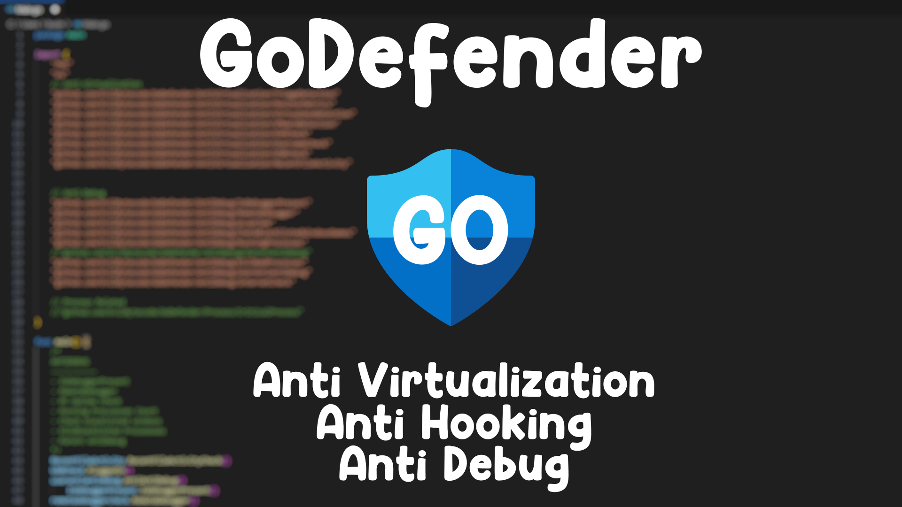

<p align="center">
  <a href="#"></a>
  <a href="#"></a>
  <a href="#"></a>
</p>

# 🛡️ GoDefender 🛡️

A powerful Go-based security toolkit designed to detect and defend against debugging, virtualization, and DLL injection attacks. GoDefender provides comprehensive protection mechanisms to make reverse engineering and analysis significantly more difficult.

**⚠️ WINDOWS ONLY - Designed for Windows systems**



## 🚀 Quick Start

```bash
install.bat
```

## Features

### Anti-Virtualization
* VMware Detection (video controller analysis)
* VirtualBox Detection (driver and file scanning)
* KVM Detection (hypervisor identification)
* QEMU Detection (emulator detection)
* Parallels Detection (macOS virtualization)
* Display Refresh Rate Analysis (< 29Hz detection)
* Screen Resolution Validation
* USB Device History Checking
* VM Artifact File Scanning
* Port Configuration Analysis
* Named Pipes Detection
* Blacklisted Username Checking

### Anti-Debugging
* IsDebuggerPresent API monitoring
* Remote Debugger Detection
* Parent Process Validation (explorer.exe, cmd.exe)
* Process Blacklist Detection (OllyDbg, x64dbg, IDA Pro, WinDbg)
* Window Title Scanning (analysis tool detection)
* Process Count Monitoring
* Repetitive Process Pattern Detection
* Critical Function Patching (DbgUiRemoteBreakin, DbgBreakPoint)
* Debug Filter State Protection
* Memory Zeroing and Cleanup
* Internet Connection Validation
* Process Inheritance Analysis

### Anti-DLL Injection
* LoadLibrary Function Patching
- Patching Dll Taking Advantage of Binary Image Signature Mitigation Policy to prevent injecting Non-Microsoft Binaries.

### Quick Nutshell
- Detects most anti-anti-debugging hooking methods on common anti-debugging functions by checking for bad instructions on function addresses (most effective on x64). It also detects user-mode anti-anti-debuggers like ScyllaHide and can detect some sandboxes that use hooking to monitor application behavior/activity (like [Tria.ge](https://tria.ge/)).

## Telegram:
- https://t.me/ebytelabs

## 🤝 Contributing

Feel free to open issues for additional anti-debugging features, improvements, or bug reports. Contributions are welcome!
Linux support is welcome

## 📜 License

This project is licensed under the MIT License - see the [LICENSE](LICENSE) file for details.

## ⚠️ Disclaimer

This software is provided for educational and legitimate security research purposes only. Use responsibly and only on systems you own or have explicit permission to test.

## 🙏 Credits

- **AdvDebug** - Initial inspiration - [GitHub](https://github.com/AdvDebug)
- **MmCopyMemory** - Technical insights and ideas - [GitHub](https://github.com/MmCopyMemory)
- **baum1810** - Port Check Idea - [GitHub](https://github.com/baum1810)
- **HydraDragonAntivirus** - replacing WMIC with WMI - [GitHub](https://github.com/HydraDragonAntivirus)

---

**Star this project if you found it useful! It encourages continued development and improvement.**
